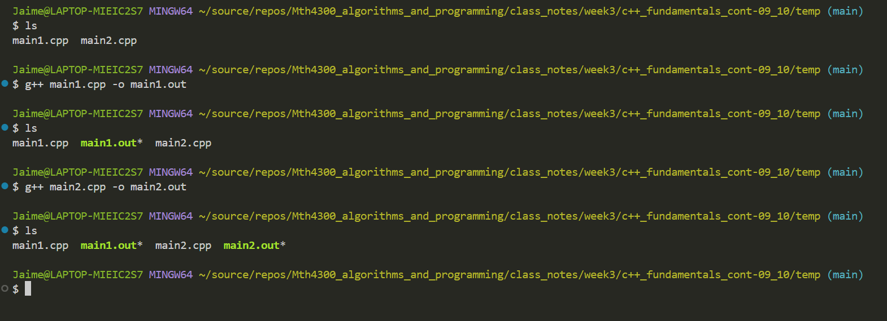

# Lecture Notes

## table of contents
1. Check Python in Docker!
2. Compilation and Arguments
3. Operators 
4. Conditional Statements 
5. For Loops
6. In class assignments


## Check Python in Docker!
You can open docker and run ```python3 main.py```(from this directory) and run your first python program in docker!


## Compilation and Arguments
So far we have seen compilation like this: ```g++ main.cpp``` and we know that this will create an a.out file. Sometimes we may have multiple files in a directory, say **main1.cpp** and **main2.cpp** and we don't want the compilation of **main1.cpp** to overwrite the compilation of **main2.cpp**. To solve this problem, we can simply just name the compilation of **main1.cpp** as  main1.out and **main1.cpp** as main2.out. To change the name of output executable file produced by g++ we use the `-o` flag. <br>
**Example:**
```
g++ main1.cpp -o main1.out
g++ main2.cpp -o main2.out
```
**Produces:**<br>



## Operators
Operators are symbols that perform operations on variables and values.
### Arithmetic Operators
The arithmetic operators work exactly as they do in regular math. They take values as inputs(must be integer or decimal) and return the result of the arithmetic operation.
* \+ adds values
* \- subtracts values
* / divides
* \* multipies
* % is referred to as the mod operator. This opeartor divides the first value by the second then returns the remainder. Example: ```cout<<15%2;``` would print 1. Inputs must be integers to use this operator.
to include logical(boolean), arithmetic(ints and floats), string
* = assigns a value to a variable

### Logical Operators
Logical Operators are used to test if some condition is true or false. They take in two values as input, and return either true or false.  
* ! The not operartor. This is the only operator on the list that takes in only one input value. Returns the negation of the input value.
* && The and operator. Returns true if both inputs are true, otherwise returns false. 
* || The or operator. Returns true if at least one of the inputs is true, otherwise returns false.
* == The equality operator. Returns true if the two inputs are equivalent, otherwise return false.


### Object Operators
C++ is an oject oriented class. What this means is that the software developer has the power to create his own classes(which are treated as types internally). C++ allows us to overload the operators for these classes, which means give semantic meaning to something like **class toaster + class bread**. This statement does not make sense unless we apply meaning to the + operator by overloading it. More on operator overloading in the future!<br><br>

One example is the string class + operator. The + operator for strings is going to concatenate the two strings. For an example check out this [code](./concatenate.cpp)


## Conditional Statements
Conditional statements in C++ allow the program to make decisions based on certain conditions. These statements control the flow of execution by executing different code blocks depending on whether a condition is true or false. The most common conditional statements in C++ are:

### 1. if statement
The if statement executes a block of code if a specified condition evaluates to true.

```cpp
if (condition) { 
    // Code to be executed if condition is true
}
```

#### Example:

```cpp
int a = 10; 
if (a > 5) { 
    cout << "a is greater than 5" << endl;
}
```

### 2. else statement
The else statement is used in conjunction with if. It provides an alternative block of code that will be executed if the condition in the if statement is false.

```cpp
if (condition) { 
    // Code to be executed if condition is true
} else { 
    // Code to be executed if condition is false
}
```

#### Example:

```cpp 
int a = 3;
if (a > 5) { 
    cout << "a is greater than 5" << endl;
}
else { 
    cout << "a is not greater than 5" << endl; 
}
```

### 3. else if statement
The else if statement allows you to test multiple conditions. If the first if condition is false, the program checks the else if condition.

```cpp
if (condition1) {
     // Code to be executed if condition1 is true
}
else if (condition2) { 
    // Code to be executed if condition2 is true
} 
else { 
    // Code to be executed if none of the conditions are true
}
```

#### Example:

```cpp
int a = 7; 
if (a > 10) { 
    cout << "a is greater than 10" << endl;
} 
else if (a == 7) { 
    cout << "a is equal to 7" << endl;
} 
else { 
    cout << "a is less than or equal to 10 but not 7" << endl;
}
```

### 4. switch statement
The switch statement tests a variable or expression against multiple cases. Each case is followed by the code that will execute if the case is matched. The default case handles any situation where none of the cases match.

```cpp
switch (expression) { 
    case constant1: // Code to be executed if expression == constant1 
        break; 
    case constant2: // Code to be executed if expression == constant2 
        break; 
    // More cases 
    default: 
        // Code to be executed if none of the cases match 
} 
```

#### Example:

```cpp
int day = 2; 
switch (day) { 
    case 1: 
        cout << "Monday" << endl; 
        break; 
    case 2: 
        cout << "Tuesday" << endl;
        break; 
    default: 
        cout << "Invalid day" << endl;
}
```


## For Loops
In C++, loops are used to execute a block of code repeatedly. The two common types of loops are `for` loops and `while` loops. Here's a brief overview of for loops:

### `for` Loop

A `for` loop is used when you know in advance how many times you want to execute a statement or a block of statements. It consists of three parts:

1. **Initialization**: Set up a loop control variable.
2. **Condition**: Check if the loop should continue.
3. **Update**: Modify the loop control variable.

**Syntax:**

```cpp
for (initialization; condition; update) {
    // Code to be executed
}
```

#### Example:

```cpp
#include <iostream>
using namespace std;

int main() {
    for (int i = 0; i < 5; i++) {
        cout << i << " ";
    }
    return 0;
}
```

In this example, the loop starts with i set to 0, continues as long as i is less than 5, and increments i by 1 in each iteration. It prints numbers from 0 to 4.


## In class assignments
1. Write a code that calculates max{a,b} and stores the result in the variable m. 
2. Write a code that checks whether the real number x belongs to the union of the open intervals 
(5 - 15)U(95 - 202). If it does, the program should print yes. If it does not, the program should print no.
3. Assume that the user is asked to provide an integer x through the standard input. The program will check whether x is bigger than 100. If it is, then the program will print: "Congratulations! You know about big numbers!"If x is not bigger than 100, then the program will print:"Good enough. Try with a bigger number next time."